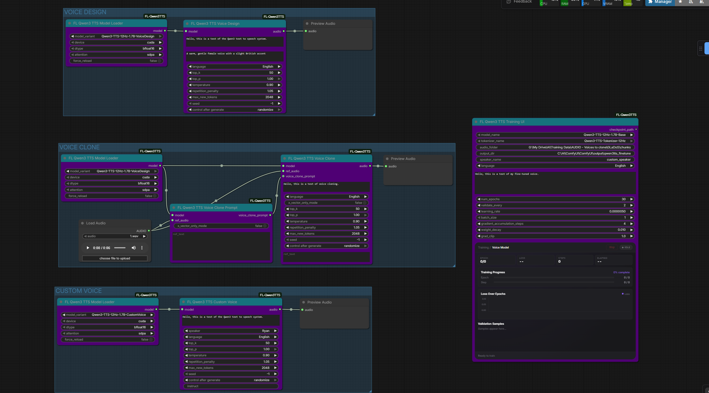

# FL Qwen3 TTS

Advanced text-to-speech nodes for ComfyUI powered by Alibaba's Qwen3-TTS model family. Features voice cloning, voice design from text descriptions, predefined speakers, and a built-in fine-tuning UI with real-time training dashboard.

[](https://github.com/QwenLM/Qwen3-TTS)
[](https://www.patreon.com/Machinedelusions)



## Features

- **Voice Cloning** - Clone any voice from 5-15 seconds of reference audio
- **Voice Design** - Create custom voices from natural language descriptions
- **9 Predefined Speakers** - Ready-to-use voices across Chinese, English, Japanese, and Korean
- **Fine-Tuning UI** - Train custom voice models with a real-time dashboard (loss chart, progress, validation audio)
- **10 Languages** - Chinese, English, Japanese, Korean, German, French, Russian, Portuguese, Spanish, Italian
- **Auto Transcription** - Built-in Whisper integration for generating reference text
- **Audio Codec** - Encode and decode audio using the Qwen3-TTS 12Hz tokenizer

## Nodes

| Node | Description |
|------|-------------|
| **Model Loader** | Downloads and caches Qwen3-TTS models from HuggingFace |
| **Tokenizer Loader** | Loads the 12Hz audio tokenizer for encoding/decoding |
| **Custom Voice** | Generate speech using 9 predefined speakers with optional style instructions |
| **Voice Design** | Create voices from natural language descriptions (e.g. "a warm British female voice") |
| **Voice Clone** | Clone a voice from reference audio |
| **Voice Clone Prompt** | Pre-compute a voice prompt for efficient multi-generation cloning |
| **Audio Encode** | Encode audio to discrete codes using the tokenizer |
| **Audio Decode** | Decode discrete codes back to audio |
| **Transcribe** | Transcribe audio to text using Whisper (useful for ref_text) |
| **Training UI** | All-in-one fine-tuning with real-time training dashboard |

## Installation

### ComfyUI Manager
Search for "FL Qwen3 TTS" and install.

### Manual
```bash
cd ComfyUI/custom_nodes
git clone https://github.com/filliptm/ComfyUI-FL-Qwen3TTS.git
cd ComfyUI-FL-Qwen3TTS
pip install -r requirements.txt
```

## Quick Start

### Text-to-Speech
1. Add **FL Qwen3 TTS Model Loader** and select a model variant
2. Connect to **Custom Voice**, **Voice Design**, or **Voice Clone** node
3. Enter your text, configure voice settings, and generate

### Voice Cloning
1. Load the **Base** model (`Qwen3-TTS-12Hz-1.7B-Base`)
2. Connect to **Voice Clone** with 5-15 seconds of reference audio
3. Optionally use **Transcribe** to generate ref_text for better results
4. Enter target text and generate

### Fine-Tuning
1. Prepare a folder with audio files and matching `.txt` transcripts
2. Add the **Training UI** node and point it to your dataset folder
3. Configure training parameters (learning rate, epochs, etc.)
4. Run the workflow — monitor progress in the real-time dashboard
5. Use the output checkpoint with **Custom Voice** for inference

## Models

| Model | Type | Use Case |
|-------|------|----------|
| Qwen3-TTS-12Hz-1.7B-Base | Base | Voice cloning and fine-tuning |
| Qwen3-TTS-12Hz-1.7B-CustomVoice | Custom Voice | 9 predefined speakers with style control |
| Qwen3-TTS-12Hz-1.7B-VoiceDesign | Voice Design | Create voices from text descriptions |

Models download automatically on first use to `ComfyUI/models/tts/Qwen3TTS/`.

## Predefined Speakers

Available with the **CustomVoice** model:

| Speaker | Language | Description |
|---------|----------|-------------|
| Vivian | Chinese | Bright, edgy female |
| Serena | Chinese | Warm, gentle female |
| Uncle_Fu | Chinese | Seasoned male |
| Dylan | Chinese | Beijing dialect male |
| Eric | Chinese | Sichuan dialect male |
| Ryan | English | Dynamic male |
| Aiden | English | American male |
| Ono_Anna | Japanese | Japanese female |
| Sohee | Korean | Korean female |

## Dataset Format (Training)

```
audio_folder/
  sample1.wav
  sample1.txt    # contains transcript of sample1.wav
  sample2.mp3
  sample2.txt
  ...
```

Supported audio formats: `.wav`, `.mp3`, `.flac`, `.ogg`, `.m4a`

## Requirements

- Python 3.9+
- 16GB RAM minimum (32GB+ recommended for training)
- NVIDIA GPU with 12GB+ VRAM recommended (CPU and Mac MPS supported for inference)

## License

Apache 2.0
